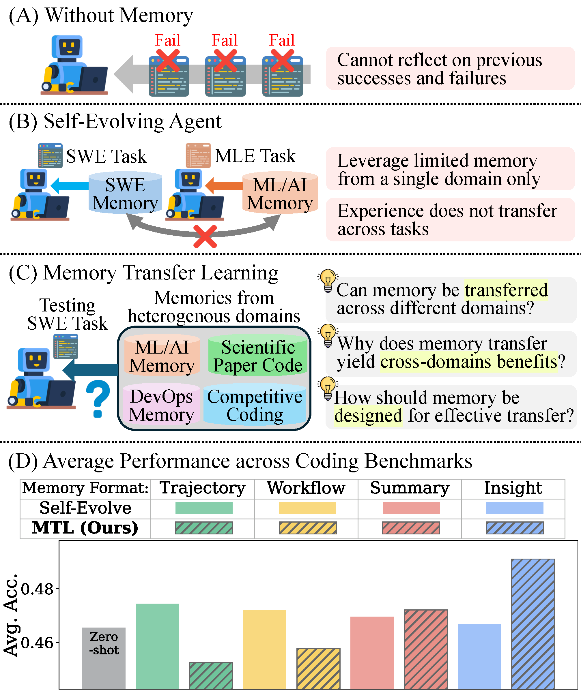
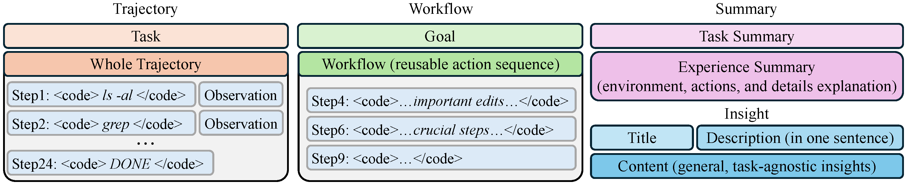

# Memory Transfer Learning: How Memories are Transferred Across Domains in Coding Agents

<div align="center">

[](https://arxiv.org/abs/2604.14004)
[](https://memorytransfer.github.io/)

**[Kangsan Kim](https://kangsankim07.github.io/)<sup>1</sup>, [Minki Kang](https://nardien.github.io/)<sup>1</sup>, Taeil Kim<sup>1</sup>, [Yanlai Yang](https://yanlai00.github.io/)<sup>2</sup>, [Mengye Ren](https://mengyeren.com/)<sup>2†</sup>, [Sung Ju Hwang](http://www.sungjuhwang.com/)<sup>1,3†</sup>**

<sup>1</sup>KAIST &nbsp;&nbsp; <sup>2</sup>New York University &nbsp;&nbsp; <sup>3</sup>DeepAuto.ai &nbsp;&nbsp; <sup>†</sup>Equal advising

Correspondence: kangsan.kim@kaist.ac.kr

</div>

---

## TL;DR

We investigate cross-domain memory transfer for coding agents and show that leveraging a unified memory pool from heterogeneous benchmarks improves average performance by **3.7%**. Abstraction is the key: high-level insights generalize across domains while low-level traces induce negative transfer.

## Overview

Existing self-evolving coding agents restrict memory usage to the same benchmark. We propose **Memory Transfer Learning (MTL)**, which leverages a unified memory pool from heterogeneous domains, and show it consistently outperforms domain-restricted approaches.

<div align="center">

</div>

**(A)** Memory-less agents cannot reflect on past experience. **(B)** Self-evolving agents leverage memory but only within a single domain. **(C)** MTL leverages a unified memory pool from heterogeneous coding tasks. **(D)** MTL (hatched bars) consistently outperforms self-evolving agents across all four memory formats.

### Research Questions

- **RQ1**: Does memory from heterogeneous domains improve the performance of coding agents?
- **RQ2**: Why do transferred memories yield benefits across different domains?
- **RQ3**: Which factors in memory transfer learning most influence transfer effectiveness?

## Method

### Memory Representations

We construct four types of memory representations spanning a spectrum from concrete low-level traces to abstract high-level insights:

<div align="center">

</div>

| Type | Description |
|---|---|
| **Trajectory** | Concatenates all agent commands and execution results. Contains full task-solving detail including failed steps. |
| **Workflow** | Extracts a reusable goal-oriented workflow — a goal statement plus a subset of meaningful actions. |
| **Summary** | Prompts an LLM to summarize the task, environment, actions, and an analysis of success or failure. |
| **Insight** | Generalizable principles written to be task-agnostic for effective cross-domain transfer. |

### Memory Retrieval Pipeline

1. **Memory Generation** — Run the agent across all benchmarks. Use an LLM judge to assess success/failure, then generate all four memory types from each trajectory.
2. **Pool Construction** — Merge memories from all benchmarks except the target. Index each memory using *text-embedding-3-small* for fast retrieval.
3. **Retrieval & Inference** — For each query, retrieve the top-3 most similar memories and prepend them to the coding agent's system prompt before inference.

## Results

### Main Results (Pass@3 across 6 Benchmarks)

| Method | LiveCodeBenchv6 | Aider-Polyglot | SWEBench-Verified | TerminalBench2 | ReplicationBench | MLGym-Bench | Avg. |
|---|---|---|---|---|---|---|---|
| **GPT-5-mini** | | | | | | | |
| Zero-Shot | 0.910 | 0.470 | 0.730 | 0.315 | 0.111 | 0.667 | 0.523 |
| MTL (T) | 0.940 | 0.490 | 0.770 | 0.270 | 0.122 | 0.583 | 0.534 |
| MTL (W) | 0.920 | 0.470 | 0.770 | 0.348 | 0.111 | 0.583 | 0.538 |
| MTL (S) | 0.930 | 0.460 | 0.760 | 0.371 | 0.133 | 0.667 | 0.546 |
| **MTL (I)** | **0.930** | **0.470** | **0.770** | **0.360** | **0.189** | **0.750** | **0.560** |
| Δ | +2.0% | 0.0% | +4.0% | +4.5% | +7.8% | +8.3% | **+3.7%** |

### Comparison with Self-Evolving Baselines

MTL outperforms ReasoningBank (+2.9%) and AgentKB (+1.7%) with only **431 memories** — far fewer than AgentKB's 5,899 memories.

| Method | #Memories | LiveCodeBenchv6 | SWEBench-Verified | ReplicationBench | Avg. |
|---|---|---|---|---|---|
| Zero-Shot | — | 0.910 | 0.730 | 0.111 | 0.584 |
| ReasoningBank | 97 | 0.920 | 0.750 | 0.133 | 0.601 |
| AgentKB | 5,899 | 0.920 | 0.720 | 0.200 | 0.613 |
| **MTL (Ours)** | **431** | **0.930** | **0.770** | **0.189** | **0.630** |

## Key Findings

- **Finding 1**: MTL significantly improves coding agent performance and outperforms self-evolving methods in both effectiveness and efficiency.
- **Finding 2**: The primary form of transferable knowledge is *meta-memory* encoding procedural and behavioral guidance — not domain-specific code.
- **Finding 3**: More abstract and generalized memory representations yield higher transfer effectiveness by avoiding brittle implementation anchoring.
- **Finding 4**: Negative memory transfer arises from domain-mismatched misleading anchors, false validation signals, and misapplied procedural reuse.
- **Finding 5**: MTL effectiveness scales with the size of the memory pool and the number of source domains.
- **Finding 6**: Memory can be transferred across different models; self-generated memories yield the best performance, but cross-model transfer consistently beats zero-shot.
- **Finding 7**: Cross-domain memory retrieval is inherently challenging; static retrieval methods fail to generalize in heterogeneous agentic settings.

## Code

> **Coming Soon**

## Acknowledgements

Our work builds upon [Harbor](https://github.com/harbor-framework/harbor) and [Mini-SWE-Agent](https://github.com/SWE-agent/mini-swe-agent). We thank the authors for releasing their code.

## BibTeX

```bibtex
@misc{kim2026memorytransferlearningmemories,
  title={Memory Transfer Learning: How Memories are Transferred Across Domains in Coding Agents}, 
  author={Kangsan Kim and Minki Kang and Taeil Kim and Yanlai Yang and Mengye Ren and Sung Ju Hwang},
  year={2026},
  eprint={2604.14004},
  archivePrefix={arXiv},
  primaryClass={cs.AI},
  url={https://arxiv.org/abs/2604.14004}, 
}
```
